# RoboSims — Isometric Virtual Lab Builder

An isometric virtual lab/factory builder where universities and companies design their workspace layouts and manage their robot fleet. Offered free by **Autodiscovery**.

## Reference Images

The user provided a factory-floor reference showing clean isometric industrial environments with robotic arms, conveyor belts, hazard markings, and storage equipment. The robot asset library includes **29 isometric robot PNGs** across 3 packs:

````carousel

<!-- slide -->

<!-- slide -->

<!-- slide -->

````

---

## User Review Required

> [!IMPORTANT]
> **Technology choice**: I propose building this as a **Vite + vanilla JavaScript** single-page application with an **HTML5 Canvas** isometric engine. No heavy frameworks — this keeps it lightweight, fast to iterate, and easy to host on your Linux server as static files. The robot management panels and UI chrome will be HTML/CSS overlays on top of the canvas. Does this approach work for you, or would you prefer React/Vue?

> [!IMPORTANT]
> **Backend / Persistence**: For the initial version, I'll use **localStorage** for saving lab designs. For the production version with user registration and login, you'll need a backend (e.g., Flask/FastAPI on your Linux server with a database). Should I scaffold a simple backend now, or focus purely on the frontend first?

> [!IMPORTANT]
> **Scope for V1**: I plan to deliver a fully functional **frontend-only** first version with all the features below. Authentication and server-side persistence would be Phase 2. Agree?

---

## Proposed Changes

### Architecture Overview

```mermaid
graph TD
    A["index.html"] --> B["main.js — App bootstrap"]
    B --> C["IsometricEngine — Canvas rendering"]
    B --> D["UIManager — Panel orchestration"]
    B --> E["AssetLibrary — Drag & drop catalog"]
    B --> F["RobotManager — Fleet data & status"]
    
    C --> C1["Grid renderer"]
    C --> C2["Camera controls — pan, zoom"]
    C --> C3["Object placement & z-sorting"]
    C --> C4["Room/wall system"]
    
    D --> D1["Toolbar — tools, modes"]
    D --> D2["Asset panel — categorized browser"]
    D --> D3["Properties panel — selected item"]
    D --> D4["Robot detail panel — full info"]
    
    E --> E1["Rooms & Walls"]
    E --> E2["Furniture & Equipment"]
    E --> E3["Machines & Conveyors"]
    E --> E4["Robots — 29 models"]
    
    F --> F1["Status tracking"]
    F --> F2["Booking calendar"]
    F --> F3["Maintenance log"]
    F --> F4["Equipment & specs"]
    
    style A fill:#1a1a2e,color:#fff
    style B fill:#16213e,color:#fff
    style C fill:#0f3460,color:#fff
    style D fill:#0f3460,color:#fff
    style E fill:#0f3460,color:#fff
    style F fill:#0f3460,color:#fff
```



---

### Phase 1 — Isometric Engine & Core UI

#### [NEW] `index.html`
- Main application shell with canvas element and UI overlay containers
- Google Fonts (Inter), meta tags, SEO
- Loading screen with Autodiscovery branding

#### [NEW] `index.css`
- Complete design system: dark theme, glassmorphism panels, CSS custom properties
- Color palette: deep navy (#0a0e1a) base, electric blue (#00d4ff) accents, warm amber (#ff8c00) for status indicators
- Panel layouts, scrollbar styling, animations, responsive breakpoints
- Isometric cursor styles, drag ghost styling

#### [NEW] `js/main.js`
- Application bootstrap, module wiring, event bus
- Save/load to localStorage
- Keyboard shortcuts (Delete, Escape, Ctrl+Z undo)

#### [NEW] `js/isometric-engine.js`
- **Canvas-based isometric renderer** using 2:1 isometric projection
- Grid system: configurable grid size (default 20×20 tiles, expandable)
- Camera controls: mouse drag to pan, scroll to zoom, minimap
- Tile coordinate ↔ screen coordinate conversion
- Z-sorting (painter's algorithm) for correct object layering
- Grid snapping for placed objects
- Selection highlight with glow effect
- Room rendering: floor fill, wall segments rendered as isometric shapes

#### [NEW] `js/asset-library.js`
- Categorized asset catalog: **Robots**, **Rooms**, **Furniture**, **Equipment**, **Machines**, **Decorations**
- Each category populated with items (robots from your 29 PNG assets; rooms/furniture/equipment drawn as isometric SVG/canvas shapes)
- Drag-from-panel-to-canvas placement flow
- Search/filter functionality
- Asset metadata (name, category, size in tiles, description)

#### [NEW] `js/ui-manager.js`
- **Left toolbar**: Mode buttons (Select, Place, Room Draw, Delete, Pan)
- **Right asset panel**: Categorized scrollable asset browser with thumbnail grid
- **Bottom properties panel**: Shows details of selected object, edit name/rotation
- **Top bar**: Lab name, save/load buttons, zoom controls, Autodiscovery logo
- Panel show/hide animations (slide in/out with glassmorphism blur)

---

### Phase 2 — Robot Management System

#### [NEW] `js/robot-manager.js`
- Robot data model with all fields:
  - **Identity**: name, model, manufacturer, serial number, image
  - **Status**: location (In Lab / On Field Trial / In Maintenance / Stored), online/offline
  - **Hardware**: version, installed equipment list (sensors, arms, grippers)
  - **Software**: OS, ROS version, firmware version
  - **Maintenance**: status (OK / Due Soon / Overdue), log entries with dates
  - **Warranty**: start date, end date, status (Active / Expired)
  - **Booking**: calendar with time slots, reserved-by user
- Status color coding: green (operational), amber (maintenance due), red (offline/issue)

#### [NEW] `js/robot-detail-panel.js`
- Full-screen slide-out panel when clicking a placed robot
- **Header**: Large robot image, name, model, status badge
- **Tabbed sections**:
  1. **Overview** — Location, status, quick stats
  2. **Equipment** — Installed sensors, peripherals, accessories with icons
  3. **Specifications** — Hardware version, software version, manufacturer, serial
  4. **Maintenance** — Status indicator, log table (date, type, description, technician)
  5. **Booking** — Calendar view, create/view reservations
  6. **Warranty** — Coverage details, expiry countdown
- Edit mode for each section
- Animated status indicators (pulsing dot for online robots)

---

### Phase 3 — Room Builder & Environment Assets

#### [NEW] `js/room-builder.js`
- Click-and-drag room creation on the isometric grid
- Room types: Lab, Office, Workshop, Warehouse, Corridor, Outdoor Area
- Floor textures per room type (tile, concrete, grass, hazard-striped)
- Wall auto-generation along room perimeters
- Door/window placement on walls
- Room labels and color coding

#### [NEW] `js/environment-assets.js`
- Canvas-drawn isometric assets for the non-robot items:
  - **Furniture**: desks, chairs, shelving units, cabinets, whiteboards
  - **Lab Equipment**: workbenches, oscilloscopes, 3D printers, charging stations
  - **Industrial**: conveyor belts, robotic arms, pallets, storage tanks, safety barriers
  - **Decorations**: plants, monitors, signage, floor markings (hazard stripes like your reference image)
- All drawn procedurally on canvas in matching isometric style
- Rotation support (4 directions)

---

### Phase 4 — Polish & Persistence

#### [NEW] `js/auth-manager.js` *(stub for future backend)*
- Login/Register modal UI
- localStorage session for now
- API endpoints interface ready for Flask/FastAPI backend
- User profile: name, organization, saved labs

#### [NEW] `js/save-manager.js`
- Serialize entire lab state to JSON (grid, objects, robots, rooms)
- localStorage save/load with named slots
- Export/Import as JSON file download
- Auto-save every 60 seconds

---

## File Structure

```
Robot Sims/
├── index.html              # Main app shell
├── index.css               # Complete design system
├── js/
│   ├── main.js             # App bootstrap & orchestration
│   ├── isometric-engine.js # Canvas isometric renderer
│   ├── asset-library.js    # Asset catalog & data
│   ├── ui-manager.js       # UI panels & toolbar
│   ├── robot-manager.js    # Robot fleet data
│   ├── robot-detail-panel.js # Robot info slide-out
│   ├── room-builder.js     # Room drawing tool
│   ├── environment-assets.js # Procedural environment items
│   ├── save-manager.js     # Persistence (localStorage + file)
│   └── auth-manager.js     # Auth UI stub
├── assets/
│   ├── Isometric robots 1/ # Existing UGV assets
│   ├── Isometric robots 2/ # Existing humanoid/quadruped assets
│   └── Isometris robots 3/ # Existing Spot-style assets
└── creation prompt.md
```

---

## Open Questions

> [!IMPORTANT]
> 1. **Backend scope**: Should I include a Flask/FastAPI backend scaffold for user auth and persistent lab storage now, or keep this purely frontend for V1?
> 2. **Room/furniture art style**: For rooms and furniture, I'll draw isometric shapes procedurally on canvas to match your robot art style. Are you okay with that, or do you have additional asset packs for furniture/equipment?
> 3. **Grid size**: Default lab grid of 20×20 tiles — is that a reasonable starting size? Users will be able to expand it.
> 4. **Branding**: Should the app be called "RoboSims" or do you have a preferred name for this product? Should I use the Autodiscovery logo/colors you typically use?

---

## Verification Plan

### Automated Tests
- Launch with `npx serve .` (or Vite dev server) and verify in browser
- Test grid rendering, pan/zoom, asset placement, z-sorting
- Test robot detail panel data display and tab navigation
- Test save/load round-trip (save lab → reload page → load lab → verify state)

### Manual Verification
- Visual inspection of isometric rendering with all 29 robot assets placed
- Test drag-and-drop from asset panel to canvas
- Verify robot detail panel shows all data fields
- Test room drawing tool
- Responsive layout check at different viewport sizes

### Browser Testing
- Use browser subagent to navigate the app, place robots, open detail panels, and capture recordings
